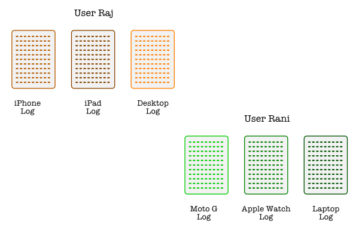
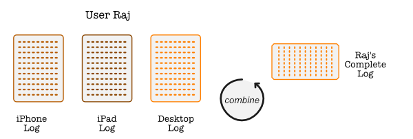
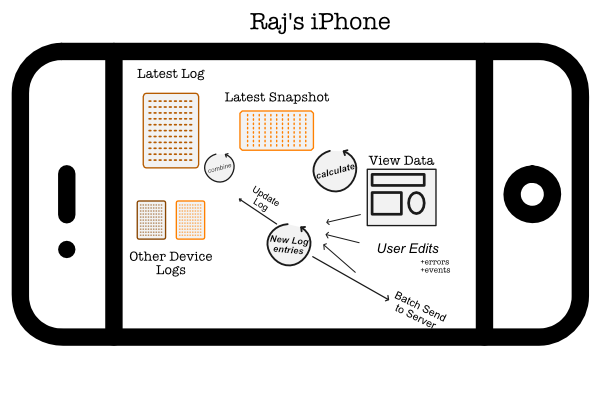

# Tagtime Data

## The problem
Tagtime pings must be answered _at the instant they arise_ and so it is
important to have the system available on everywhere - on your phone,
tablet, laptop, desktop, or watch.

However we also would like the system to work offline - in case the
server fails, the user's network fails, or for some reason or the other
the user cannot connect to the network.

In this situation, we run into synchronization problems. As anyone who
has used any syncrhonization service (Apple Cloud, iTunes, Azure Active
Directory) has experienced, synchronization is a "hard problem" that
cannot simply be _tacked on_ to an existing architecture. Software
developers were forced into this realization early yet it took nearly
four decades until version control tools matured to the point where
synchronization became truly usable with the advent of
[git](https://git-scm.com/) and [github](https://github.com/).

### User Data
It is important to note that if either of these two requirements are not
present (i.e. we can guarantee network synchronization OR only single
entry point), this problem does not exist. However, we would like a
robust system hence we must deal with the issue for ping and tag data.

However the situation for user data (user profile, billing info, and
login) is different - here we do not need to support offline (or even
multi-device). It is sufficient for the user to create and manage their
account when they are connected and through a web interface.

User data will therefore be stored in a MySQL database in a traditional
user table with tenant info and so on. The design of this database
structure is described below:

    [[GK to detail out]]

We now turn our attention to the problem of pings & tags.

## Enter the ... Log
When we examine the way [git](https://git-scm.com/) and
[other](https://bitcoin.org/bitcoin.pdf)
[distributed](https://en.wikipedia.org/wiki/Blockchain)
[systems](https://engineering.linkedin.com/distributed-systems/log-what-every-software-engineer-should-know-about-real-time-datas-unifying)
systems work we find at their heart a very simple structure - the Log.

This structure gave rise to the [Kappa
Architecture](http://milinda.pathirage.org/kappa-architecture.com/)
which we will use as the basis for our design of the TagTime database.

## Log Structure Details
The tagtime ping logs will have the following characteristics:
1. Each user/device will have it's own log
2. Each log is an immutable list of records
3. Each record is sequenced one after another (monotonically increasing)
   by the [unix time](https://en.wikipedia.org/wiki/Unix_time) of it's
   entry.

Hence, conceptually the system looks like this:

Now using the unix time of each entry we very easily interleave them to
form a combined log view:

We can see that if any view is offline for a while the combined log will
not contain it's data, but as soon as it comes back online it will
simply add it's entries into the entire stream.

## Errors and Debug Support
We will also combine error logs and event logs into the same source
stream. This allows us to analyze problems and provide user support
by re-using the same mechanism making our lives easier.

## Device View
The overall view of a single device now looks like this:

## Server View
The server simply accepts logs (subject to correct user authentication),
saves them, and pushes notifications to all connected devices that the
log has been updated. Each device can then request for updates from
whichever sequence point they last had (their last unix time for that
log).

## Types of Log Messages

Log messages can be of various types:
1. Data: Ping Data, Category data, User Config Data? etc etc
2. Error Logs
3. Event Logs
4. Commands: For example, "rename tag from X to Y" may be a command
   rather than actually updating all the data logs that contain that tag

## Components Used
These are the components we will use for TagTime data management:
1. Maria Db
2. [Bolt DB](https://github.com/coreos/bbolt) for Golang Log Storage
3. [NeDB](https://github.com/louischatriot/nedb) for Electron Client
   Storage
4. ?? for Flutter App Storage
